 Student Registration System

The Student Registration System is a web-based application developed using Laravel. It provides a digital way of collecting and managing student information through an online registration form.

The system validates user input before saving it to the database. It also supports profile picture uploads and displays a confirmation message after successful registration.

Data validation is important because it prevents incomplete, incorrect, or duplicate information from being stored. In enterprise applications, registration systems are commonly used by universities, companies, hospitals, banks, and government organizations to collect and manage user information efficiently.

3. Objectives

The main objectives of this project are to:

- Create a professional student registration form using Blade.
- Process form submissions using a Laravel controller.
- Implement server-side validation.
- Display validation error messages.
- Implement flash success messages.
- Upload and securely store student profile pictures.
- Store student information in a MySQL database.
- Display registered student information.
- Understand the Laravel request lifecycle.
- Practice Git version control and GitHub repository management.
- Document the software development process using Markdown.

4. Laravel Request Lifecycle

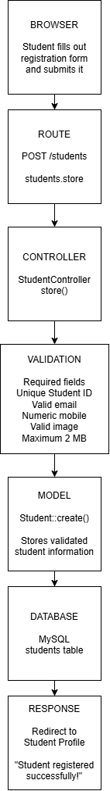

Request Flow Explanation
* The user opens the student registration page.
* The registration form is displayed using a Blade view.
* The user enters the required student information.
* The form sends a POST request to the students.store route.
* The StudentController receives the request.
* Laravel validates the submitted information.
* If validation fails, the user is returned to the form with validation error messages.
* If validation succeeds, the profile picture is uploaded to the public storage directory.
* The validated student information is saved using the Student model.
* The student record is stored in the MySQL students table.
* The application redirects the user to the student's profile page.
* A success message confirms that the registration was completed.

5. Validation Rules

The Student Registration System uses server-side validation in the
StudentController to ensure that submitted information is complete,
correct, and safe before it is stored in the database.

The following validation rules are implemented:

|      Validation Rule      |                                                             Field(s)                                                          |                         Purpose                              |
|---------------------------|-------------------------------------------------------------------------------------------------------------------------------|--------------------------------------------------------------|
|         Required          | Student ID, First Name, Last Name, Email, Mobile Number, Date of Birth, Gender, Program, Year Level, Address, Profile Picture |  Prevents important information from being submitted empty   |
|         Nullable          |                                                            Middle Name                                                        |      Allows the student to leave the middle name blank       |
|          Unique           |                                                         Student ID, Email                                                     |    Prevents duplicate student records and email addresses    |
|          Email            |                                                           Email Address                                                       |       Ensures the email follows a valid email format         |
|         Numeric           |                                                           Mobile Number                                                       |  Ensures that the mobile number contains numeric characters  |
|          Image            |                                                          Profile Picture                                                      |         Ensures that the uploaded file is an image           |
|        MIME Type          |                                                          Profile Picture                                                      |        Restricts uploads to JPG, JPEG, and PNG files         |
|     Maximum File Size     |                                                          Profile Picture                                                      |            Limits the uploaded image to 2 MB                 |
| String and Maximum Length |                                                        Names and Student ID                                                   | Prevents inappropriate data types and excessively long input |

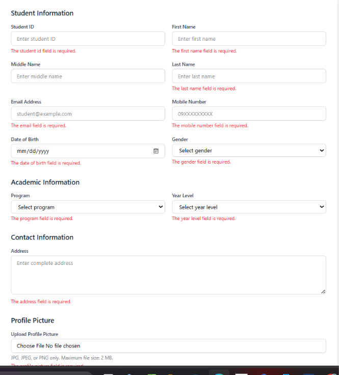
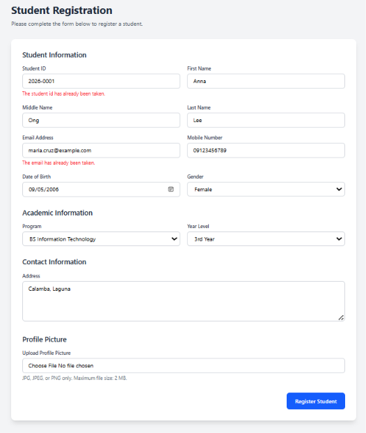

6. Database Design

- The Student Registration System uses MySQL to store registered student
information. The database structure was created using a Laravel migration.

- The main table used by the application is the students table.

  * Entity Relationship Diagram (ERD)

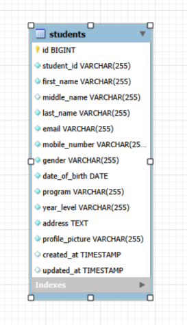

The students table is the main application table. It stores the student's
personal information, contact information, academic information, and profile
picture path.

  * Students Table Structure

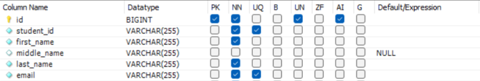
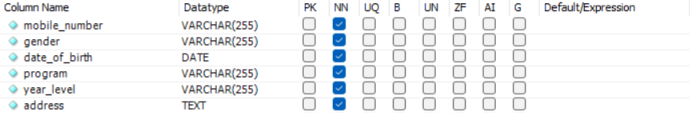
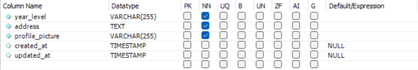

7. Flowchart

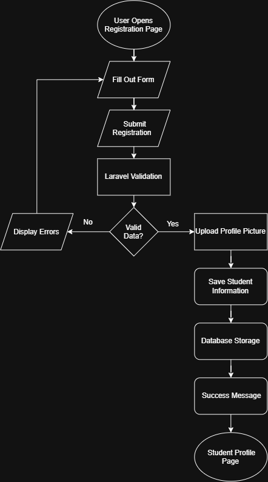

8. Screenshots

- Registration Form
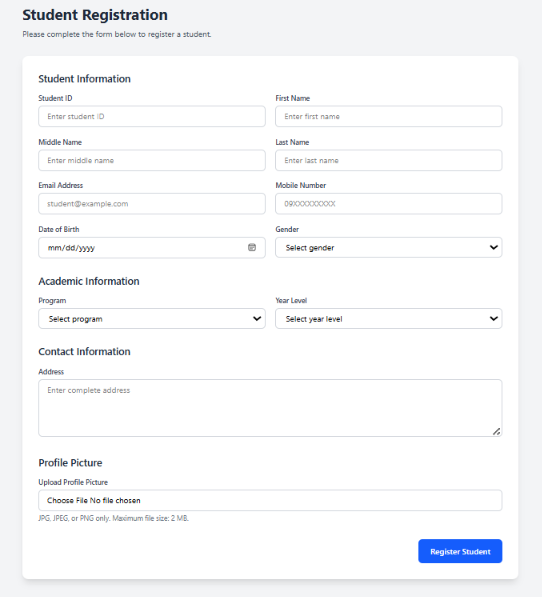

- Validation Errors


- Successful Registration
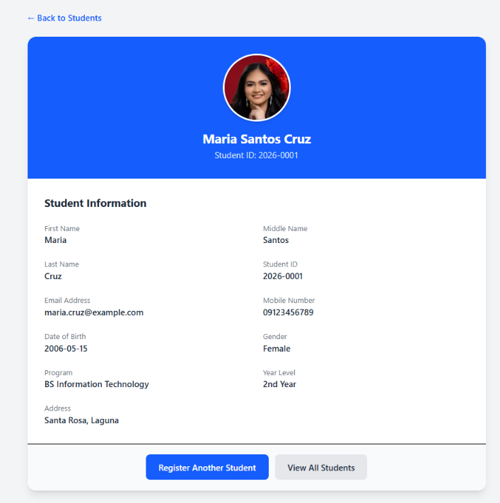

- Flash Message
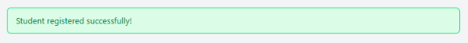

- Uploaded Profile Picture


- Database Table
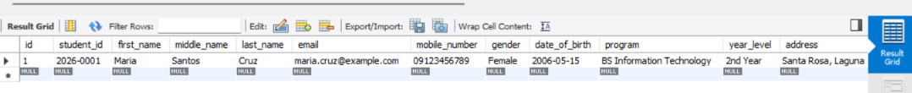

- Student Profile Page


-  VS Code Project Structure
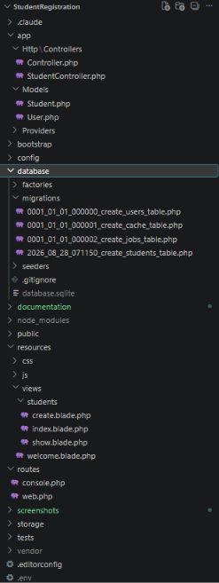

-  GitHub Repository
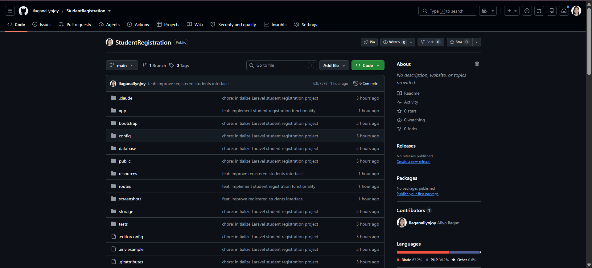

9. Problems Encountered

During the development of the Student Registration System, several
challenges were encountered while configuring Laravel, connecting the
database, implementing validation, and handling profile picture uploads.

- Database Driver Error
One of the first problems encountered was a database driver error: "could not find driver"
Laravel was initially configured to use SQLite, but the required SQLite
driver was not available in the PHP environment. This prevented the
application from connecting to the database and loading the registration
page correctly.

- Cache Table Error
Another problem occurred when running Laravel cache commands. The
application was already configured to use MySQL, but the cache table did
not exist in the registration database. Laravel therefore returned a
database error when attempting to clear the application cache.

- Student ID Database Error
During registration, the application returned the following error: "Field 'student_id' doesn't have a default value"
The registration form was successfully sending the student ID, but the
database insertion initially attempted to save only the profile picture.
This indicated that the submitted student information was not being passed
correctly to the model during the database operation.

- Duplicate StudentController Declaration
A PHP fatal error occurred because the StudentController class had been
declared more than once. The controller code had accidentally been placed
inside "Controller.php" while another "StudentController.php" already
existed. This prevented Laravel commands such as "php artisan route:list" from
running.

- Vite Manifest Error
The application also displayed a Vite manifest error: "Vite manifest not found"
This occurred because the frontend assets had not yet been built and the
required Vite manifest file did not exist in the public/build directory.

- Storage Link Issue
The profile picture upload required Laravel's public storage link. Without
the storage link, uploaded images could be stored successfully but would not
be accessible through the application's public URLs.

10. Solutions

The problems encountered during development were resolved by checking the
Laravel configuration, correcting the application code, and using the
appropriate Laravel commands.

- Solving the Database Driver Error
The database configuration was changed from SQLite to MySQL in the .env
file. The application was configured to use the registration MySQL
database with the correct host, port, username, and password.

The configuration cache was then cleared using:

"```text
php artisan config:clear"

11. 

Working on the Student Registration System deepened my insight into the necessity of user input validation and protection in a web application. While my initial perception of validation included checking whether a user submitted the correct data, I have also discovered its role in protecting the database from invalid, repeated, and irrelevant information. Indeed, the system’s validation mechanism, which used the required, unique, email, numeric, image, and max rules, ensured that the data saved in the database met the expected standards. The most valuable lesson I acquired while working on the project was proper user input handling. Specifically, information submitted by a user should not be directly saved in the database. Instead, it should pass through a series of validation procedures to determine whether it meets the system’s requirements. Laravel’s validation mechanism was useful in this case, as it allowed me to verify the user input before saving the data in the database. Additionally, I have learned the significance of the fillable property in the Student model. In particular, the property determined which data would be saved in the database when the user submitted the information via mass assignment.

Furthermore, I have learned the importance of server-side validation and discovered that it should be used even if the application implements client-side validation. While the latter is convenient and time-saving, it should only play an auxiliary role in an application because client-side scripts can be tampered with. Instead, web applications should use server-side validation to ensure the accuracy and validity of the user input, which is then stored in the database. For instance, the Student Registration System demonstrated that Laravel performed validation inside the StudentController when it created a student. Besides the technical details of the registration system, the project also provided valuable insight into the significance of a registration system in enterprise applications. For instance, universities utilize such systems to collect and store students’ data, while business applications use them to store information about employees or customers. Indeed, various other organizations, including healthcare facilities and government agencies, use registration systems to manage vast amounts of data about their clients or employees. Therefore, the development of the Student Registration System was an invaluable experience for me because it introduced me to multiple aspects of enterprise-level applications.

In conclusion, the project deepened my understanding of Laravel, web applications, and databases. The application’s user validation and input mechanisms were particularly informative because they highlighted the importance of file security, database design, and server-side scripts in web applications. Laravel’s validation tools, which I used extensively while working on the project, were relatively straightforward but effective in identifying invalid data types or images. Finally, the project also provided me with insight into the conventional practices of collaborative coding, as I followed the.git guidelines when pushing my commits. Overall, the challenges I faced while working on the project taught me how to address and resolve database, controller, config, and storage-related issues in Laravel applications. Thus, the project was an enriching experience for me because it provided me with opportunities to gain practical experience with Laravel’s database, MVC architecture, Git version control, and validation mechanisms.

12. References

Laravel. (n.d.). *Laravel documentation*. Retrieved August 28, 2026, from
https://laravel.com/docs

MDN Web Docs. (n.d.). *MDN Web Docs*. Retrieved August 28, 2026, from
https://developer.mozilla.org/

MySQL. (n.d.). *MySQL 8.0 reference manual*. Retrieved August 28, 2026, from
https://dev.mysql.com/doc/refman/8.0/en/

PHP Documentation Group. (n.d.). *PHP manual*. Retrieved August 28, 2026, from
https://www.php.net/docs.php

Tailwind Labs. (n.d.). *Tailwind CSS documentation*. Retrieved August 28,
2026, from https://tailwindcss.com/docs